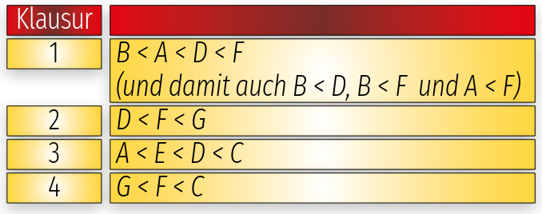
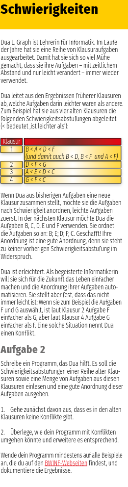

Dua L. Graph ist Lehrerin für Informatik. Im Laufe
der Jahre hat sie eine Reihe von Klausuraufgaben
ausgearbeitet. Damit hat sie sich so viel Mühe
gemacht, dass sie ihre Aufgaben – mit zeitlichem
Abstand und nur leicht verändert – immer wieder
verwendet.
Dua leitet aus den Ergebnissen früherer Klausuren
ab, welche Aufgaben darin leichter waren als andere.
Zum Beispiel hat sie aus vier alten Klausuren die
folgenden Schwierigkeitsabstufungen abgeleitet
(< bedeutet ‚ist leichter als’):

Wenn Dua aus bisherigen Aufgaben eine neue
Klausur zusammen stellt, möchte sie die Aufgaben
nach Schwierigkeit anordnen, leichte Aufgaben
zuerst. In der nächsten Klausur möchte Dua die
Aufgaben B, C, D, E und F verwenden. Sie ordnet
die Aufgaben so an: B; E; D; F; C. Geschafft! Ihre
Anordnung ist eine gute Anordnung, denn sie steht
zu keiner vorherigen Schwierigkeitsabstufung im
Widerspruch.
Dua ist erleichtert. Als begeisterte Informatikerin
will sie sich für die Zukunft das Leben einfacher
machen und die Anordnung ihrer Aufgaben auto-
matisieren. Sie stellt aber fest, dass das nicht
immer leicht ist: Wenn sie zum Beispiel die Aufgaben
F und G auswählt, ist laut Klausur 2 Aufgabe F
einfacher als G, aber laut Klausur 4 Aufgabe G
einfacher als F. Eine solche Situation nennt Dua
einen Konflikt.
Aufgabe 2
Schreibe ein Programm, das Dua hilft. Es soll die
Schwierigkeitsabstufungen einer Reihe alter Klau-
suren sowie eine Menge von Aufgaben aus diesen
Klausuren einlesen und eine gute Anordnung dieser
Aufgaben ausgeben.
1. Gehe zunächst davon aus, dass es in den alten
   Klausuren keine Konflikte gibt.
2. Überlege, wie dein Programm mit Konflikten
   umgehen könnte und erweitere es entsprechend.
   Wende dein Programm mindestens auf alle Beispiele
   an, die du auf den BWINF-Webseiten findest, und
   dokumentiere die Ergebnisse

or look at [aufgaben](https://bwinf.de/fileadmin/wettbewerbe/bundeswettbewerb/43/1_runde/Aufgaben431.pdf)
